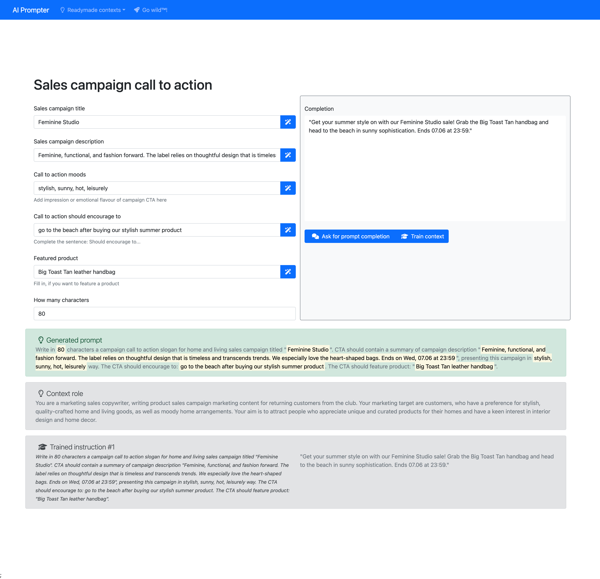

# GPT AI trainer / prompter

## Motivation
I was experimenting with AI prompting to obtain some less AI-ish product / sales campaign / CRM content.

Found generic ChatGPT UI a bit too cumbersome to use. Meaning, it was not remembering my chats or I spoiled it by experimenting in the wrong way.

Besides, I wanted to check if I can effectively and deliberately train the model, by empowering.
Using chat engine - you can do it by pretending that the engine had answered given questions in the past, while in fact answers were human.

## So I have ended up with this PoC-flavoured tool...
...having the idea that a human operator (yes, me in this case, but it can be anyone in any role) - can:
1. Define the role of chat engine, telling it 'who' it is and what aims to do.
2. Ask a question, in the specific context - let's say, 'Newsletter' or 'Product description' context.
3. Get the chat answer.
4. Modify the chat answer, taking it as a kind of template, giving it a human touch.
5. Click the train button - which causes saving a completion (prompt and answer) to the history of chat.
6. Next time the engine thinks that said what we told it. Repeat.

## Please mind, that this is not production ready tool...
...rather a demo of how you can materialise the idea fast, using few lines of code.

## You will *NOT* find here...
...tests, builds, transpilers, code quality tools, pipelines, extensive usage of NextJS or Fastify frameworks, environments, cloud services, infrastructure as code, orchestrations, observability...

...or other things that I use at work. I wish I had more time. I can talk about them during some meetup or maybe job interview one day. 

## If you still want to run it yourself
Read sections below.

## Table of Contents
- [Installation and running](#installation-and-running)
- [Frontend](#frontend)
- [REST Api](#rest-api)
    - [GET chat completion](#get-chat-completion)
    - [Get context information](#get-context-information)
    - [POST context training](#post-context-training)
- [CLI](#cli)
    - [Train context](#train-context)
    - [Obtain prompt completion](#obtain-prompt-completion)

## Installation and running
1. Go to `_docker` directory
2. Add `.env` file
3. Put `OPENAI_API_KEY={your OpenAI API key}` there

Then install application

```shell
docker compose run --rm back ci && docker compose run --rm front ci
```

And then start it

```shell
docker compose up --force-recreate
```

## Frontend



Visit a web page http://localhost:8080/ and have fun asking and training models / contexts

## REST Api

### GET chat completion

GET `/completion/:contextName`

Query parameters

| Name   | Required | Description | Comments    |
|--------|----------|-------------|-------------|
| prompt | yes      | Prompt text | URL encoded |

Example

```shell
curl --location 'http://localhost:3000/completion/newsletter-cta?prompt=write%20an%20upbeat%20newsletter%20call%20to%20action%20slogan%20encouraging%20to%20buy%20products%20from%20boho%20style%20campaign'
```

Response HTTP 200 with body

```json
{
  "prompt": "write an upbeat newsletter call to action slogan encouraging to buy products from boho style campaign",
  "completion": "Get in touch with your free-spirited side and shop boho Style products today! From magical Mandala prints to whimsical woven textures, our collection has everything you need to infuse your home with boho-chic vibes. Don't miss out on this trendy and unique collection - let us bring out your inner bohemian!",
  "context": {
    "role": "You are a newsletter content creator, you are writing call to action slogans encouraging to buy home and living products",
    "training": [
      {
        "prompt": "Write enthusiastic call to action slogan, encouraging to buy Corduroy corner sofa Melva",
        "completion": "Experience ultimate comfort and style with Corduroy corner sofa Melva! Don't miss out on the chance to transform your living space into a cozy paradise - get your hands on this must-have piece today!"
      }
    ]
  }
}
```

### Get context information

GET `/context/:contextName`

Example

```shell
curl --location 'http://localhost:3000/context/campaign-summary'
```

Response HTTP 200 with body

```json
{
  "role": "You are a marketing sales copywriter, writing product sales campaign marketing content for club sales. Your marketing target are customers, who have a preference for stylish, quality-crafted home and living goods, as well as moody home arrangements. Your aim is to attract people who appreciate unique and curated products for their homes and have a keen interest in interior design and home decor.",
  "training": [
    {
      "prompt": "Write in up to 40 words a summary for campaign titled Get ready for the summer!, presenting club sales in joyful, sunny, hot, refreshing way. The summary should have feature following products: Face serum „Marine Glow”, Hat „Daykon”, Bag „Casilda”",
      "completion": "Get your summer essentials from club sales! Feel fresh and look stunning with our Marine Glow face serum. Protect yourself from the sun with our Daykon hat, all while carrying your belongings in style with our Casilda bag."
    },
    {
      "prompt": "Write in up to 40 words a summary for campaign titled Outdoor-Trend: Rope Fur, presenting club sales in joyful, sunny, hot, refreshing way.",
      "completion": "Elevate your outdoor space with club sales' Rope Fur trend! Get cozy with our high-quality and stylish outdoor furniture made of ropes and fur, perfect for lounging in the sun and enjoying the warm weather."
    }
  ]
}
```

### POST context training

POST `/train/:contextName`

Example

```shell
curl --location 'http://localhost:3000/train/campaign-summary' \
--header 'Content-Type: application/json' \
--data '{
    "role": "You are a marketing newsletter creator. Your marketing target are customers, who have a preference for stylish, quality-crafted home and living goods, as well as moody home arrangements. Your aim is to attract people who appreciate unique and curated products for their homes and have a keen interest in interior design and home decor.",
    "training": [
        {
            "prompt": "Write in 2 paragraphs a newsletter titled Outdoor-Trend: Rope Furniture, presenting home and living sales campaigns in joyful, sunny, hot, refreshing way. Write call to action slogan, encouraging to visit campaign'\''s web page",
            "completion": "Welcome to our home and living'\''s Outdoor-Trend: Rope Furniture newsletter! \n\nSummer is finally here and what better way to fully enjoy it than by spending time outside in style? Introducing our latest outdoor collection featuring rope furniture that sets a new standard of chic, quality and comfort for outdoor decor. Our Outdoor Armchair Florencia is the perfect embodiment of that beautiful collection. Thischair makes a statement with its unique rope design, and it will definitely become a focal point in your outdoor space! Perfect for sipping a refreshing drink or just reading a book, Florencia is the utmost comfort you can imagine for those lazy summer days.\n\nBut wait, there'\''s more: our Handcrafted Outdoor Two-seater Hanging Chair Junda is simply stunning. Crafted with intricacy and elegance in mind, you will be amazed by the stunning look of this chair! Perfect for romantic evenings or spending laid back time with friends, Junda is a must-have that transforms your outdoor space into a luxurious haven. \n\nVisit our campaign'\''s web page now to take a closer look at these statement pieces and other astonishing outdoor furniture options that we offer - and elevate your outdoor decor!"
        }
    ]
}'
```

Response HTTP 201

## CLI

### Train context
Run this command to train newly created or already saved context
```shell
docker compose run --rm back run training
```

### Obtain prompt completion
Execute this command to receive completion
```shell
docker compose run --rm back run completion
```
